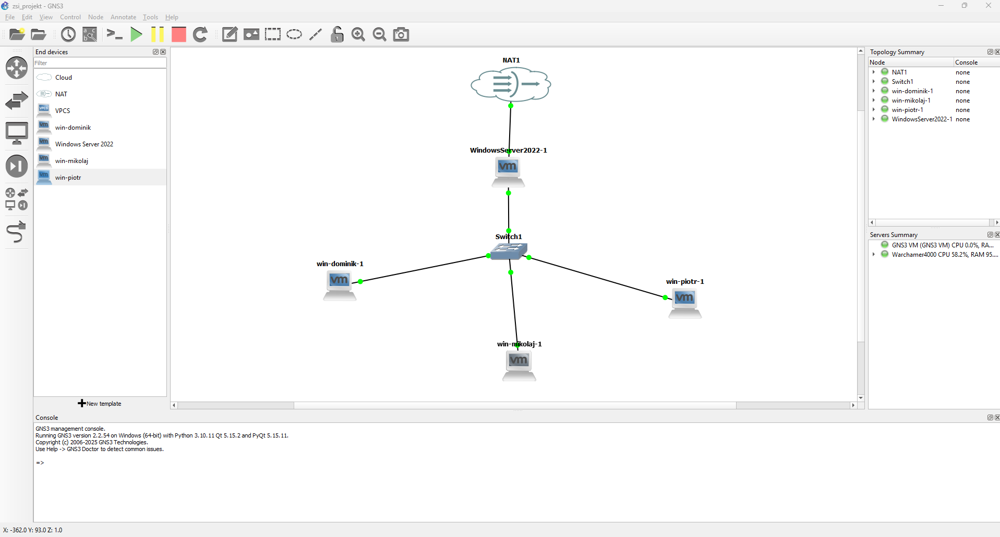

# 🚀 ZSI Project

A full-stack web application featuring a Python backend and a modern JavaScript frontend. The entire project is containerized using Docker for easy deployment and scalability.

> Full documentation [dokumnetacja.pdf](./dokumentacja.pdf)

---

## 🏗️ Architecture

The application is built with a microservices-oriented architecture:

-   **Frontend**: A static web application built with HTML, CSS, and JavaScript, served by a high-performance **Nginx** web server.
-   **Backend**: A robust API powered by **Python**, handling all the business logic.
-   **Containerization**: Both services are containerized using **Docker** and orchestrated with **Docker Compose**, ensuring a consistent environment from development to production.

## 🌐 Deployment & Infrastructure

This application was deployed in a corporate-like environment simulated on a local machine. 🖥️

    

-   The application was hosted on **Windows Server**.
-   It was integrated with **Active Directory (AD)**, allowing authenticated domain users to access and use its features.
-   The entire network infrastructure, consisting of one **Windows Server** and three **Windows client machines**, was designed and simulated using **GNS3** in conjunction with **VMware** for virtualization. This setup allowed for realistic testing of network connectivity and user authentication scenarios. ✨
